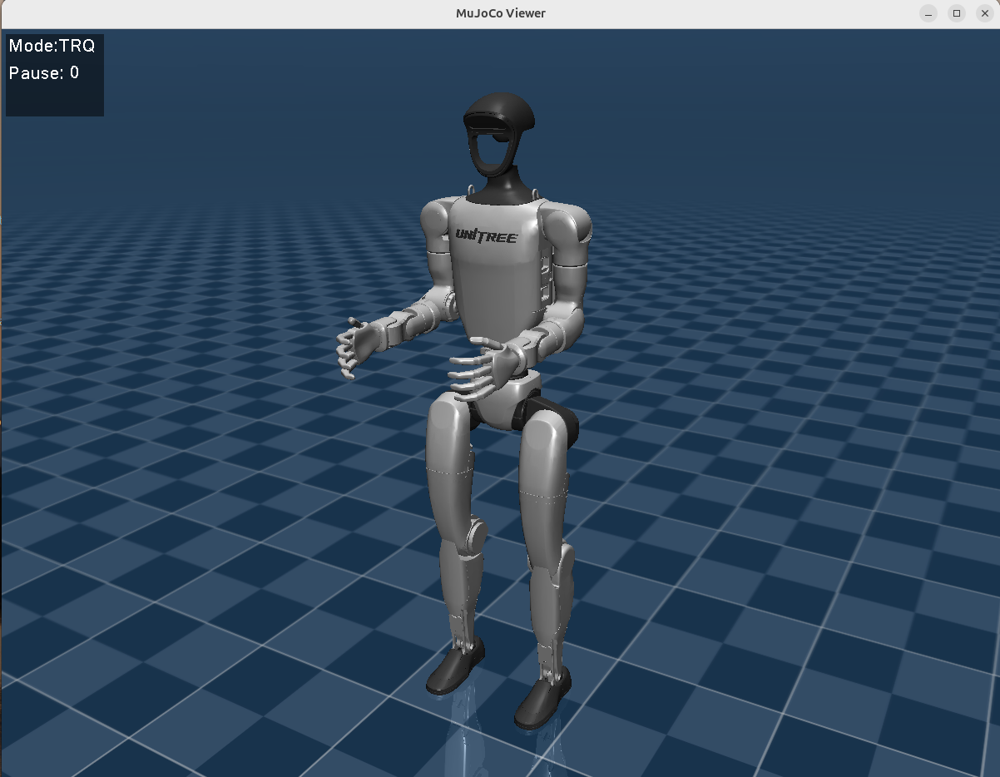
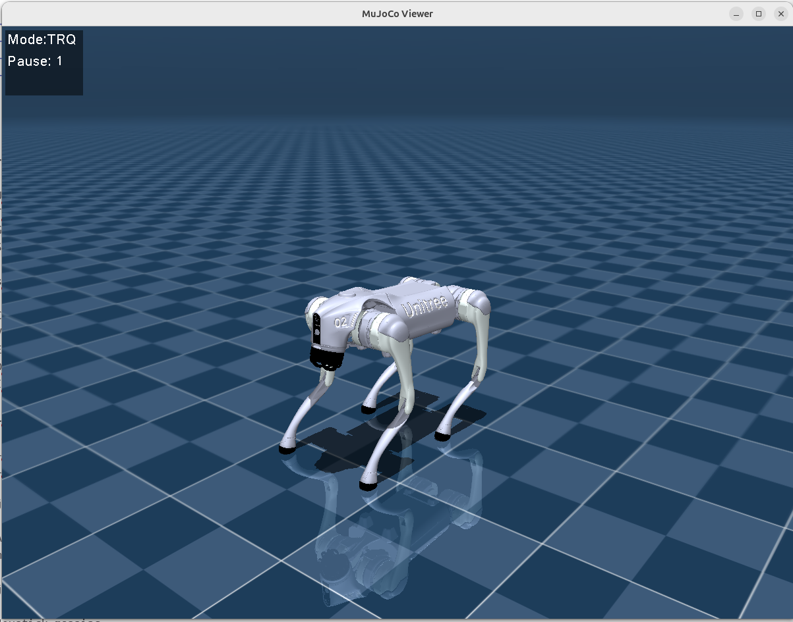
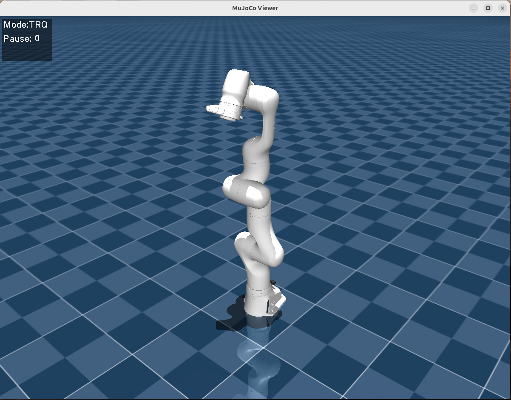

# MUJOCO C++ ROS 2 WRAP

## Overview

This project is a small, low-latency MuJoCo ROS 2 wrapper designed to be easy to understand, modify, and extend.

Its purpose is to run a MuJoCo physics simulation inside a ROS 2 environment, allowing custom controllers to be developed and tested as independent ROS 2 packages.

The wrapper was created to test a control strategy developed in Simulink for a custom-designed rover during a research experience at the University of Rome Tor Vergata.

It is not intended to be a production-ready simulator or a full replacement for larger simulation frameworks. The goal is to provide a lightweight and hackable bridge between MuJoCo and ROS 2.

Main goals:

* run a MuJoCo simulation from a ROS 2 node;
* publish simulated robot states through standard ROS 2 messages;
* receive actuator commands from ROS 2 topics;
* visualize the simulation with the native MuJoCo viewer;
* keep the system simple, fast, and easy to extend.

---
<p align="center">
  
  
  
</p>

---
## Design Principles

### Simplicity first

The wrapper intentionally keeps MuJoCo visible instead of hiding it behind a complex abstraction layer. A new developer should quickly understand where the model is loaded, where the physics step is executed, where ROS 2 messages are exchanged, and where rendering is updated.

### Low latency and asynchronous rendering

The simulation, ROS 2 callbacks, and viewer rendering are separated to avoid unnecessary blocking.

The physics loop runs in a dedicated thread, ROS 2 callbacks are handled by a `MultiThreadedExecutor`, and rendering runs separately in the main thread at a configurable frame rate.

Before rendering, the simulation state is copied into a dedicated render data structure. This avoids direct access to the same MuJoCo data used by the physics loop.

### ROS 2 interoperability

The wrapper uses standard ROS 2 messages whenever possible:

* `sensor_msgs/msg/JointState`
* `geometry_msgs/msg/TwistStamped`
* `nav_msgs/msg/Odometry`
* `rosgraph_msgs/msg/Clock`
* TF broadcasting

This makes it compatible with common ROS 2 tools such as `ros2 topic echo`, `ros2 topic pub`, `rviz2`, `rqt_graph`, and custom controller nodes.

### MuJoCo remains the physics engine

MuJoCo is responsible for physics. ROS 2 is used as the communication layer around the simulation.

Robot models, joints, actuators, contacts, constraints, and simulation properties are mainly defined in the MuJoCo XML model.

### Easy extension

The project is structured to simplify future additions such as reset, pause, step services, simulated sensors, actuator mode handling, improved TF generation, and robot-specific extensions.

---

## Software Architecture

```text
mujoco_cpp_ros2_wrap/
├── .devcontainer/
│   └── devcontainer.json
│
├── docker/
│   └── Dockerfile
│
├── src/
│   ├── interfaces/
│   │   └── ...
│   │
│   ├── mj_ros2_bringup/
│   │   ├── config/
│   │   │   └── mj_ros2_params.yaml
│   │   │       # Main configuration file.
│   │   │
│   │   ├── launch/
│   │   │   └── wrap.launch.py
│   │   │       # Main launch file.
│   │   │
│   │   └── ...
│   │
│   └── mujoco_ros2_wrapper/
│       ├── include/
│       │   └── mujoco_ros2_wrapper/
│       │       └── mj_ros2_wrap.hpp
│       │
│       ├── src/
│       │   ├── main.cpp
│       │   └── mj_ros2_wrap.cpp
│       │
│       ├── CMakeLists.txt
│       └── package.xml
│
├── Robots/
│   ├── unitree_go2/
│   │   ├── assets/
│   │   └── scene.xml
│   │
│   ├── unitree_g1/
│   │   └── ...
│   │
│   └── ...
│
└── README.md
```

---

## Main Components

### `main.cpp`

`main.cpp` initializes ROS 2, creates the `MujocoWrap` node, starts the ROS 2 executor in a separate thread, and keeps the MuJoCo viewer running in the main thread.

Execution flow:

1. initialize ROS 2;
2. create the `MujocoWrap` node;
3. create a `MultiThreadedExecutor`;
4. spin the executor in a dedicated thread;
5. render the MuJoCo viewer in the main thread;
6. stop the executor and shut down ROS 2 when the viewer is closed.

### `MujocoWrap`

`MujocoWrap` is the main ROS 2 node of the project.

It handles:

* ROS 2 parameters;
* MuJoCo XML loading;
* MuJoCo model and data initialization;
* native MuJoCo viewer setup;
* ROS 2 publishers and subscribers;
* physics thread execution;
* actuator command reception;
* robot state publication;
* `/clock` publication;
* TF broadcasting.

---

## Quick Start

### 1. Clone the repository

```bash
git clone git@github.com:EmDonato/Mujoco_Ros2_Wrap_Cpp.git
cd Mujoco_Ros2_Wrap_Cpp
code .
```

### 2. Open the Dev Container

In VS Code, open the command palette:

```text
Ctrl + Shift + P
```

Then select:

```text
Dev Containers: Reopen in Container
```

VS Code will build and start the Docker-based development environment.

### 3. Build the workspace

Inside the container:

```bash
colcon build --symlink-install
source install/setup.bash
```

### 4. Run the wrapper

Run with a specific robot:

```bash
ros2 launch mj_ros2_bringup wrap.launch.py file_name:="Robots/unitree_g1/scene.xml"
```

```bash
ros2 launch mj_ros2_bringup wrap.launch.py file_name:="Robots/unitree_go2/scene.xml"
```

Run with the default robot from the configuration file:

```bash
ros2 launch mj_ros2_bringup wrap.launch.py
```

---

## Execution Model

The wrapper uses three execution contexts.

### ROS 2 executor thread

The ROS 2 executor handles callbacks, including actuator command subscriptions and timers.

### MuJoCo physics thread

The physics loop runs inside `MujocoWrap`.

At each iteration, it:

1. copies the latest actuator input;
2. writes commands into `data_->ctrl`;
3. executes one MuJoCo step with `mj_step`;
4. publishes simulation time;
5. broadcasts TF transforms;
6. sleeps until the next physics tick.

The default simulation period is:

```yaml
timer:
  sim_time_us: 2000
```

This corresponds to approximately:

```text
1 / 0.002 s = 500 Hz
```

### Viewer rendering loop

Rendering runs in the main thread.

At each render cycle, the wrapper copies the current simulation data, updates the MuJoCo scene, renders it, draws the overlay, swaps buffers, and polls GLFW events.

The viewer frame rate is controlled by:

```yaml
timer:
  fps: 30.0
```

---

## ROS 2 Interface

### Published topics

| Topic           | Type                              | Description |
| --------------- | --------------------------------- | ----------- |
| `/joint_states` | `sensor_msgs/msg/JointState`      | Publishes all non-free MuJoCo joint states. |
| `/odom`         | `nav_msgs/msg/Odometry`           | Publishes floating-base pose and velocity. |
| `/twist`        | `geometry_msgs/msg/TwistStamped`  | Publishes base velocity in the robot body frame. |
| `/clock`        | `rosgraph_msgs/msg/Clock`         | Publishes MuJoCo simulation time. |
| `/tf`           | `tf2_msgs/msg/TFMessage`          | Publishes body transforms. |

#### `/joint_states`

Publishes the state of all non-free MuJoCo joints:

* joint name;
* position;
* velocity;
* actuator effort.

Free joints are skipped because their state is represented through odometry and TF.

#### `/odom`

Publishes the pose and velocity of the floating base.

Current frame convention:

```text
header.frame_id = "world"
child_frame_id  = "base_link"
```

Current implementation assumes that the base free joint is stored at the beginning of the MuJoCo state arrays:

```text
qpos[0:3]  -> position
qpos[3:7]  -> quaternion orientation
qvel[0:6]  -> base velocity
```

The linear velocity is converted from world frame to body frame using the base quaternion.

#### `/twist`

Publishes the base velocity in the robot body frame:

```text
header.frame_id = "base_link"
```

#### `/clock`

Publishes MuJoCo simulation time.

ROS 2 nodes can use it by enabling simulated time.
#### `/tf`

Publishes transforms for MuJoCo bodies.

Current behavior:

```text
world -> body_1
world -> body_2
world -> body_3
...
```

This is useful for debugging, but it is not yet a proper kinematic TF tree.

Desired behavior:

```text
world -> base_link -> link_1 -> link_2 -> ...
```

---

### Subscribed topics

| Topic                  | Type                         | Description |
| ---------------------- | ---------------------------- | ----------- |
| `/joints_torque_input` | `sensor_msgs/msg/JointState` | Receives actuator commands. |

The wrapper reads the `name` field and searches for a matching MuJoCo actuator:

```cpp
mj_name2id(model_, mjOBJ_ACTUATOR, name.c_str());
```

The input field depends on the configured control mode:

| `cntrl_type` | Input field |
| ------------ | ----------- |
| `TRQ`        | `effort`    |
| `VEL`        | `velocity`  |
| `POS`        | `position`  |

Example torque command:

```bash
ros2 topic pub --once /joints_torque_input sensor_msgs/msg/JointState "{
  name: ['left_shoulder_pitch_joint'],
  effort: [0.5],
  velocity: [],
  position: []
}"
```

For torque control, ROS 2 actuator names must match the actuator names defined in the MuJoCo XML model.

---

## Parameters

### Model

```yaml
file_name: "Robots/unitree_g1/scene.xml"
```

Path to the MuJoCo XML model to load. The path is relative to the workspace root or to the runtime directory from which the node is launched.

### Control

```yaml
cntrl_type: "TRQ"
```

Selects which field is read from the incoming `JointState` command.

| Value | Input field | Typical use |
| ----- | ----------- | ----------- |
| `TRQ` | `effort`    | Torque control |
| `VEL` | `velocity`  | Velocity control |
| `POS` | `position`  | Position control |

### Timers

```yaml
timer:
  sim_time_us: 2000
  fps: 30.0
```

| Parameter           | Description |
| ------------------- | ----------- |
| `timer.sim_time_us` | Physics loop period in microseconds |
| `timer.fps`         | Viewer rendering frame rate |

### Topic publication periods

```yaml
topic:
  odom_pub_ms: 100
  twist_pub_ms: 100
  joints_pub_ms: 100
```

| Parameter             | Description |
| --------------------- | ----------- |
| `topic.odom_pub_ms`   | Odometry publication period |
| `topic.twist_pub_ms`  | Twist publication period |
| `topic.joints_pub_ms` | JointState publication period |

### Viewer

```yaml
viewer:
  show_axes: false
  show_force: false
  show_points: false
  show_joint: false
```

| Parameter            | Description |
| -------------------- | ----------- |
| `viewer.show_axes`   | Show body reference frames |
| `viewer.show_force`  | Show contact forces |
| `viewer.show_points` | Show contact points |
| `viewer.show_joint`  | Show joint directions |

---

## Keyboard and Viewer Controls

### Mouse

| Action             | Effect |
| ------------------ | ------ |
| Left mouse drag    | Rotate camera |
| Right mouse drag   | Move camera |
| Middle mouse drag  | Zoom |
| Scroll wheel       | Zoom |
| Shift + mouse drag | Alternative camera motion |

### Keyboard

| Key     | Action |
| ------- | ------ |
| `P`     | Pause / resume simulation |
| `Space` | Pause / resume simulation |
| `R`     | Reserved for future reset feature |
| `Esc`   | Close the viewer |

---

## Requirements and Platform Support

The project is distributed through a Docker-based development environment to provide a reproducible setup for ROS 2 and MuJoCo.

The default configuration targets:

* Linux x86_64;
* Docker Engine;
* Visual Studio Code;
* VS Code Dev Containers extension;
* NVIDIA GPU;
* NVIDIA driver on the host;
* NVIDIA Container Toolkit;
* X11 or XWayland;
* OpenGL-compatible graphics stack.

### Host checks

Before running the project, these commands should work on the host:

```bash
docker --version
nvidia-smi
docker run --rm --gpus all ubuntu nvidia-smi
```

If the last command fails, the default Dev Container configuration is not supported on that machine.

### Container dependencies

The Docker image provides:

* ROS 2 Jazzy;
* CycloneDDS RMW implementation;
* MuJoCo 3.9.0;
* C++ build tools;
* CMake;
* Git;
* GLFW development libraries;
* OpenGL runtime support through the host graphics stack.

Main installed packages include:

```dockerfile
build-essential
cmake
git
libglfw3-dev
wget
ros-jazzy-rmw-cyclonedds-cpp
```

### GPU and display

MuJoCo physics runs on CPU, but the native viewer uses OpenGL.

The Dev Container is launched with NVIDIA GPU support:

```json
"--gpus=all"
```

and forwards the Linux display through X11:

```json
"-e", "DISPLAY=${localEnv:DISPLAY}",
"-v", "/tmp/.X11-unix:/tmp/.X11-unix:rw"
```

On the host, X11 access may be required:

```bash
xhost +local:root
```

A common display-related error is:

```text
Could not initialize GLFW
```

---

## Notes About Control

The wrapper does not implement a high-level controller.

It only applies commands received from ROS 2 to the MuJoCo actuator array:

```cpp
data_->ctrl[i] = input_copy[i];
```

The actual behavior depends on the actuator definitions in the MuJoCo XML model.

Examples:

* torque actuators expect torque-like commands;
* position actuators depend on MuJoCo gain and bias parameters;
* velocity actuators require a suitable XML configuration.

The `cntrl_type` parameter only selects which `JointState` field is read. It does not automatically convert MuJoCo actuators between torque, position, or velocity control.

---

## Known Issues and Future Work

### TF tree

Currently, all body transforms are published with `world` as parent frame. This is useful for debugging, but it does not represent the real MuJoCo body hierarchy.

Future work: generate a correct parent-child TF tree from MuJoCo model information.

### Base pose assumption

The odometry implementation assumes that the robot has a free joint and that the floating-base state starts at:

```text
qpos[0:7]
qvel[0:6]
```

Future work: detect the free joint address from the model instead of assuming fixed indexes.

### Control mode

The wrapper uses `cntrl_type` to select the command field from `JointState`.

Future work: inspect MuJoCo actuator definitions and infer the actuator type from the XML model.

### Reset and simulation services

The `R` key is reserved for reset, but reset is not implemented yet.

Future work:

* keyboard reset;
* ROS 2 reset service;
* pause, resume, and step services;
* reset to initial or custom state.

### Sensor simulation

The wrapper currently publishes basic robot state information, but it does not yet expose MuJoCo sensors as ROS 2 messages.

Future work:

* IMU;


### Viewer requirements

The native MuJoCo viewer requires GLFW, OpenGL, display forwarding, and proper X11 permissions. Startup may fail if `DISPLAY`, GPU access, or OpenGL are not correctly configured.

---

## Roadmap

Possible improvements:

* generate a correct kinematic TF tree;
* add ROS 2 services for pause, resume, step, and reset;
* publish MuJoCo sensors as ROS 2 messages;
* automatically detect actuator type from the XML model;
* expose more launch arguments;
* add example controller packages (maybe);
* add height-field support for custom playgrounds and related ROS 2 topics for controllers.

---

## License

This project is intended for research and educational use.

MIT License

---

## Author

Emanuele Donato
